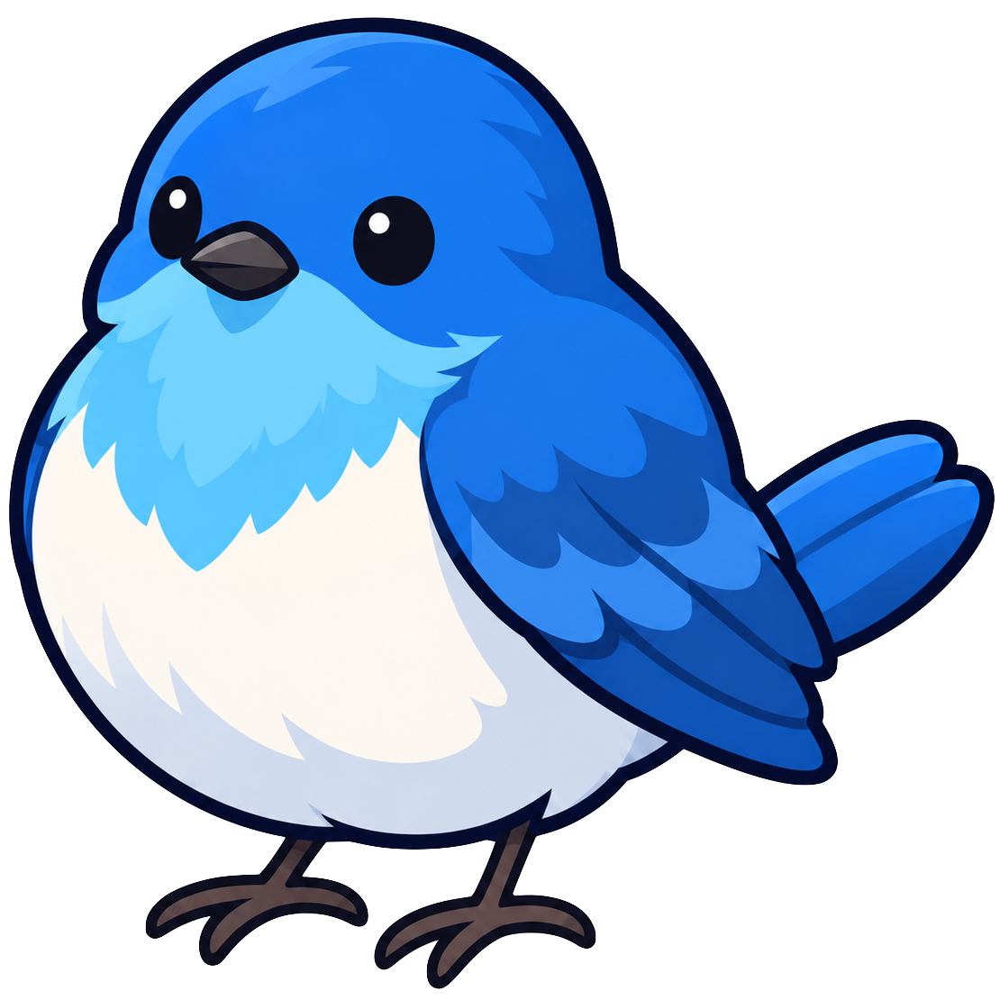

  

<h1 align="center">Robin</h1>

An AI agent that works as a Slack bot and a web UI.

Current features:

- Sign in on the web page with a Slack account.
- Mention the bot in Slack; it replies in the thread. A user who has not signed
  in receives a sign-in link instead.
- At sign-in, the user's Slack user token (`search:read`) is stored encrypted
  with Cloud KMS, for features that act on the user's behalf.
- Optionally, connect and disconnect a Google Workspace account on the settings
  page. Robin obtains read-only access to Calendar, Drive, and Gmail through an
  OAuth client of your own organization and stores the refresh token encrypted
  with Cloud KMS.
- Optionally, connect and disconnect Notion on the settings page. Robin obtains
  read-only access to the pages and databases the user shares with it, in one
  Notion workspace, and stores the tokens encrypted with Cloud KMS. Searching
  and reading those pages and databases is available to server-side code.
- Optionally, connect and disconnect a GitHub account on the settings page.
  Robin obtains a read-only user token of a GitHub App that you create for your
  deployment, stores it encrypted with Cloud KMS, and refreshes it before it
  expires.

See [docs/setup.md](docs/setup.md) for the Slack app, Google Cloud, Notion, and
GitHub App setup, and configuration. The Slack app manifest is
[docs/slack-app-manifest.yaml](docs/slack-app-manifest.yaml).

## Logo

[`assets/robin.png`](assets/robin.png) is the original logo (1110 × 1110 PNG
with transparency). Use it for the Slack app icon and other places that need
the logo. The web UI uses copies resized from it:
`frontend/src/assets/robin-logo.png` (256 px, login page),
`frontend/public/favicon.png` (64 px), and
`frontend/public/apple-touch-icon.png` (180 px).
